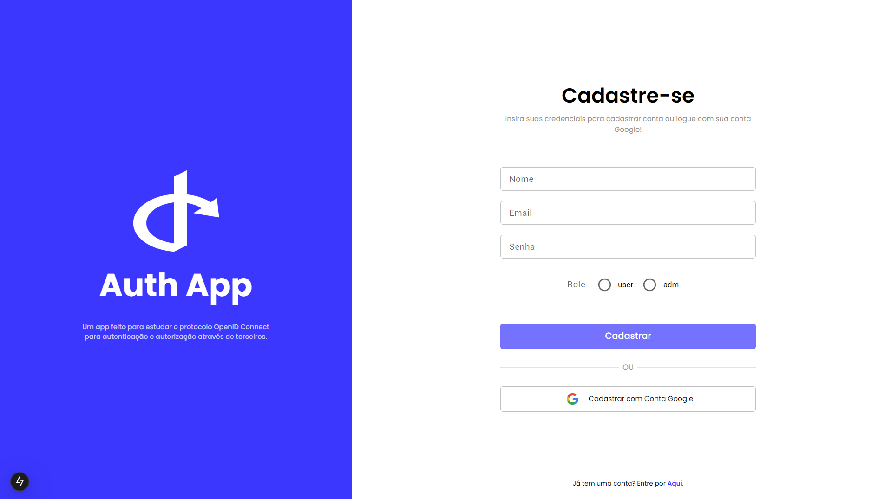
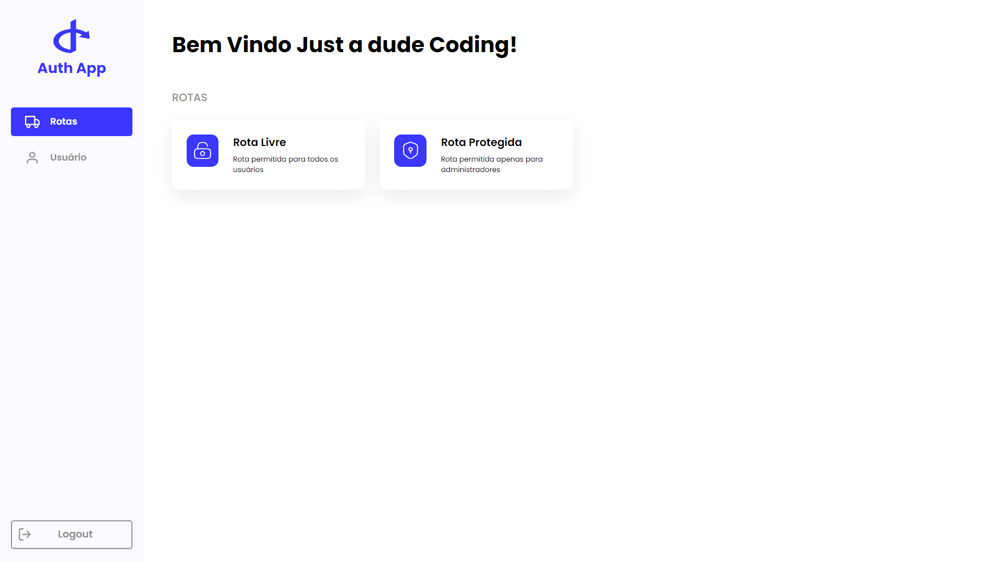

# Auth Form App

## Sumário:

- [Visão Geral](#visão-geral)
  - [Sobre o Desafio](#sobre-o-desafio)
  - [Links](#links)
- [Sobre o Processo](#sobre-o-processo)
  - [Tecnologias Utilizadas](#tecnologias-utilizadas)
  - [O que eu aprendi](#o-que-eu-aprendi)
  - [O que preciso focar mais](#o-que-preciso-focar-mais)

## Visão Geral

### Sobre o Projeto

O Auth Form App é um projeto desenvolvido para fins de estudos, se baseia em um fluxo de autenticação e autorização de usuários na plataforma. Nele, o usuário se cadastra ou loga via local (usando uma conta cadastrada na plataforma) ou com Google Account, definindo um role (adm ou user) para ele. Após isso é direcionado para a home, que contém algumas informações do usuário, função de logout, deleção de conta e rotas criadas para testar o role do usuário.

Os usuários devem ser capazes de:

- Cadastrar conta fornecendo suas credenciais para a plataforma ✅
- Cadastrar conta usando conta Google ✅
- Logar usando conta na plataforma ✅
- Logar usando conta Google já cadastrada ✅
- Acessar rota FREE se estiver autenticado ✅
- Acessar rota PROTECTED se tiver "adm" como role ✅
- Fazer logout da plataforma ✅
- Deletar conta da plataforma ✅
- Não acessar página HOME sem estarem autenticados ✅
- Não acessar página SELECT-ROLE fora do fluxo definido ✅

### Links

- 
Preview on Vercel:

## Sobre o Processo

Confira nessa sessão quais foram as tecnologias e conceitos mais utilizados nesse desafio:

### Tecnologias utilizadas

&nbsp;

- <b>NextJS</b>: framework front-end baseado em React, usado para construir interfaces com base em componentes.
- <b>Tailwind</b>: framework css que fornece classes utilitárias para estilização de componentes.
- <b>MongoDB</b>: banco de dados NoSQL usado para armazenar dados.
- <b>Bcrypt</b>: biblioteca usada para hashear senhas, garantindo maior segurança de senhas.
- <b>JWT</b>: tokens para transporte seguro de credenciais e validação, assinados digitalmente.

### O que eu aprendi?

  Nesse projeto eu explorei, estudei e coloquei em prática diversos conceitos de autenticação e autorização de usuários:

  - Me aprofundei bastante no protocolo OpenID Connect utilizado para autenticar usuário usando provedores como: Google, Github e Facebook.
  - Utilizei JWT para criar e verificar tokens de acesso, para autorizar usuários na plataforma, protegendo rotas caso o usuário não esteja cadastrado ou logado, e caso não tenha permissão necessária.
  - Fiz uso do JWT para criar e verificar refresh tokens garantindo a integridade do token de acesso.
  - Configurei cookies para armazenar os tokens de forma segura no navegado, através de flags como HttpOnly, Secure e SameSite.
  - Primeiro contato e uso do MongoDB e do driver mongoose para armazenar e gerenciar dados.
  - Prática e aprofundamento no uso do Tailwind. 

### O que preciso focar mais?

- **Typescript**: comecei o projeto com o intuito de usar Typescript, só que como é algo novo, e estava dando muito trabalho, abandonei a ideia para focar em seu real propósito.

- **React Hook Form**: uma biblioteca utilizada para lidar melhor com os estados dos componentes de um formulário. Acabei tendo contato no meio, mas como os forumários já tinham sido desenvolvidos, não adicionei ao projeto.

- **Tratamento de erros**: utilizei "code" nas responses do backend para dar contexto dos erros para o frontend, mas muitos cenários de erros ficaram faltando e sem seu devido tratamento no frontend também.